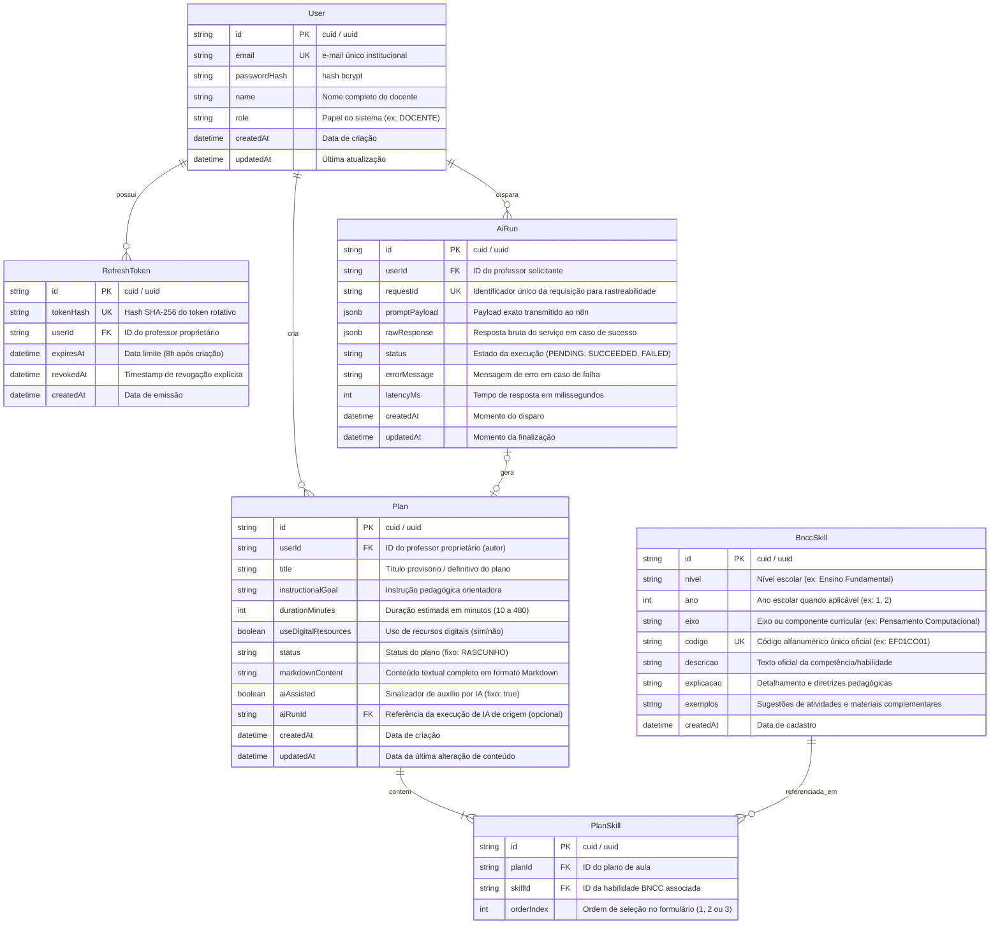

# Data Model: Planejador BNCC

**Feature**: `001-planejador-aulas-bncc`  
**Date**: 2026-10-02  
**Database**: PostgreSQL 16 (via Prisma ORM)  

---

## 1. Diagrama de Relacionamento de Entidades (ERD)



---

## 2. Entidades e Regras de Validação

### 2.1 `User`
- **Responsabilidade**: Armazena as contas docentes autorizadas no sistema.
- **Regras**:
  - `email`: Formato de e-mail válido, normalizado em minúsculas, índice único.
  - `passwordHash`: Hash gerado com `bcrypt` (fator de custo 10 ou 12). A senha em texto claro **nunca** é persistida.
  - `role`: Default `"DOCENTE"`. Sem suporte a auto-cadastro público ou CRUD administrativo nesta versão (**FR-003**).

### 2.2 `RefreshToken`
- **Responsabilidade**: Gerencia as sessões de longa duração (8 horas) para renovação do access token.
- **Regras**:
  - O valor em texto plano trafega **exclusivamente** via cookie HttpOnly.
  - No banco de dados, armazena apenas `tokenHash = sha256(refreshTokenCru)`.
  - Uma sessão é válida se e somente se: `now() < expiresAt` e `revokedAt IS NULL`.
  - Rotação estrita: a cada chamada a `/api/auth/refresh`, o token anterior é revogado e um novo par é gerado.

### 2.3 `BnccSkill`
- **Responsabilidade**: Representa o catálogo oficial de habilidades da BNCC.
- **Regras**:
  - `codigo`: Código alfanumérico único (ex.: `"EF01CO01"`).
  - `nivel`: Ex.: `"Ensino Fundamental"`.
  - `ano`: Inteiro positivo quando aplicável (ex.: `1`, `2`, `5`), ou `null` se for etapa não graduada.
  - `eixo`: Texto descritivo do componente/eixo (ex.: `"Pensamento Computacional (PC)"`).
  - `descricao`, `explicacao`, `exemplos`: Textos pedagógicos extraídos de [`docs/data/bncc-recorte.json`](file:///C:/Users/Marcio/workspace/planejador-bncc/docs/data/bncc-recorte.json). Catálogo somente leitura em tempo de execução (**FR-005**).

### 2.4 `Plan`
- **Responsabilidade**: Guarda o plano de aula individual do professor.
- **Regras**:
  - **Autorização por Propriedade**: Todo `Plan` pertence a um único `userId`. Consultas de leitura, edição e listagem filtram compulsoriamente por `userId == currentUser.id`. Tentativas de acesso com ID inexistente ou pertencente a outro professor respondem com status **HTTP 404** (**FR-020**).
  - `status`: Fixo como `"RASCUNHO"` nesta versão. Não há transição para homologado ou finalizado (**FR-021**).
  - `durationMinutes`: Inteiro no intervalo permitido de 10 a 480 minutos.
  - `aiAssisted`: `true` por padrão para planos originados pelo fluxo de assistência.
  - `markdownContent`: Texto contendo a formatação pedagógica da aula.

### 2.5 `PlanSkill`
- **Responsabilidade**: Tabela de junção entre `Plan` e `BnccSkill`.
- **Regras**:
  - Um plano deve conter **obrigatoriamente entre 1 e 3 habilidades** (**FR-007**).
  - Chave composta única `[planId, skillId]`.
  - `orderIndex`: Preserva a ordem didática da seleção.

### 2.6 `AiRun`
- **Responsabilidade**: Rastreabilidade, auditoria e controle de atomicidade da integração n8n.
- **Estados da Execução**:
  - `PENDING`: Registrado antes do envio do webhook para o n8n.
  - `SUCCEEDED`: Atualizado atomicamente junto com a criação do `Plan` no banco.
  - `FAILED`: Atualizado em caso de timeout (> 45s), erro HTTP, JSON malformado ou indisponibilidade. Nenhum plano é salvo.

---

## 3. Schema Declarativo do Prisma (`schema.prisma`)

```prisma
datasource db {
  provider = "postgresql"
  url      = env("DATABASE_URL")
}

generator client {
  provider = "prisma-client-js"
}

enum PlanStatus {
  RASCUNHO
}

enum AiRunStatus {
  PENDING
  SUCCEEDED
  FAILED
}

model User {
  id            String         @id @default(cuid())
  email         String         @unique
  passwordHash  String
  name          String
  role          String         @default("DOCENTE")
  createdAt     DateTime       @default(now())
  updatedAt     DateTime       @updatedAt

  plans         Plan[]
  refreshTokens RefreshToken[]
  aiRuns        AiRun[]

  @@map("users")
}

model RefreshToken {
  id        String    @id @default(cuid())
  tokenHash String    @unique
  userId    String
  expiresAt DateTime
  revokedAt DateTime?
  createdAt DateTime  @default(now())

  user      User      @relation(fields: [userId], references: [id], onDelete: Cascade)

  @@index([userId])
  @@map("refresh_tokens")
}

model BnccSkill {
  id          String      @id @default(cuid())
  nivel       String
  ano         Int?
  eixo        String
  codigo      String      @unique
  descricao   String
  explicacao  String
  exemplos    String
  createdAt   DateTime    @default(now())

  planSkills  PlanSkill[]

  @@index([nivel, ano])
  @@index([codigo])
  @@map("bncc_skills")
}

model Plan {
  id                   String      @id @default(cuid())
  userId               String
  title                String
  instructionalGoal    String
  durationMinutes      Int
  useDigitalResources  Boolean     @default(false)
  status               PlanStatus  @default(RASCUNHO)
  markdownContent      String
  aiAssisted           Boolean     @default(true)
  aiRunId              String?     @unique
  createdAt            DateTime    @default(now())
  updatedAt            DateTime    @updatedAt

  user                 User        @relation(fields: [userId], references: [id], onDelete: Cascade)
  aiRun                AiRun?      @relation(fields: [aiRunId], references: [id], onDelete: SetNull)
  skills               PlanSkill[]

  @@index([userId])
  @@map("plans")
}

model PlanSkill {
  id         String    @id @default(cuid())
  planId     String
  skillId    String
  orderIndex Int       @default(1)

  plan       Plan      @relation(fields: [planId], references: [id], onDelete: Cascade)
  skill      BnccSkill @relation(fields: [skillId], references: [id], onDelete: Restrict)

  @@unique([planId, skillId])
  @@map("plan_skills")
}

model AiRun {
  id            String      @id @default(cuid())
  userId        String
  requestId     String      @unique
  promptPayload Json
  rawResponse   Json?
  status        AiRunStatus @default(PENDING)
  errorMessage  String?
  latencyMs     Int?
  createdAt     DateTime    @default(now())
  updatedAt     DateTime    @updatedAt

  user          User        @relation(fields: [userId], references: [id], onDelete: Cascade)
  plan          Plan?

  @@index([userId])
  @@map("ai_runs")
}
```

---

## 4. Estratégia de Seed Idempotente

O script de inicialização do banco (`prisma/seed.ts`) executa com idempotência via `upsert`:
1. **Contas Locais de Demonstração**:
   - `ana@demo.bncc.br`: Nome `"Profª Ana Souza"`, senha definida via variável `DEMO_PASSWORD_ANA` (default local: `demo123`), senha salva via `bcrypt.hash`.
   - `marcos@demo.bncc.br`: Nome `"Prof. Marcos Lima"`, senha definida via variável `DEMO_PASSWORD_MARCOS` (default local: `demo123`), senha salva via `bcrypt.hash`.
2. **Catálogo BNCC**:
   - Carrega o arquivo [`docs/data/bncc-recorte.json`](file:///C:/Users/Marcio/workspace/planejador-bncc/docs/data/bncc-recorte.json) e realiza `upsert` com base no `codigo` da habilidade (`EF01CO01`, `EF01CO02`, `EF02CO02`, `EF02CO04`, `EF02CO06`), garantindo que execuções sucessivas não criem duplicatas.
