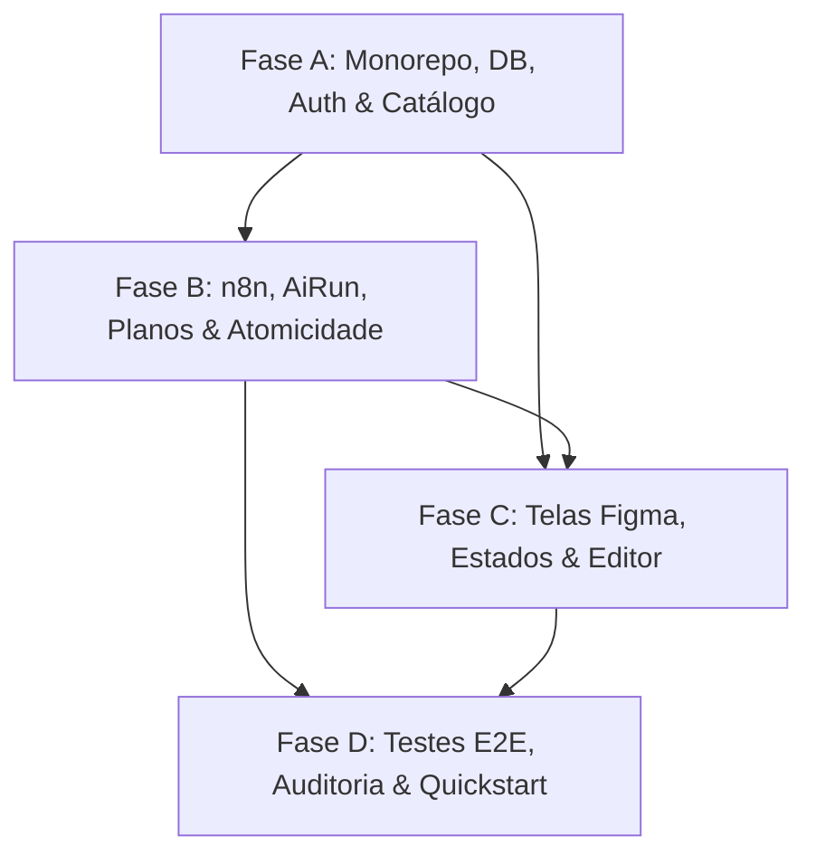

# Tasks: Planejador de Aulas BNCC

**Feature**: `001-planejador-aulas-bncc`  
**Input Documents**: [`spec.md`](file:///C:/Users/Marcio/workspace/planejador-bncc/specs/001-planejador-aulas-bncc/spec.md), [`plan.md`](file:///C:/Users/Marcio/workspace/planejador-bncc/specs/001-planejador-aulas-bncc/plan.md), [`data-model.md`](file:///C:/Users/Marcio/workspace/planejador-bncc/specs/001-planejador-aulas-bncc/data-model.md), [`research.md`](file:///C:/Users/Marcio/workspace/planejador-bncc/specs/001-planejador-aulas-bncc/research.md), [`contracts/`](file:///C:/Users/Marcio/workspace/planejador-bncc/specs/001-planejador-aulas-bncc/contracts/), [`quickstart.md`](file:///C:/Users/Marcio/workspace/planejador-bncc/specs/001-planejador-aulas-bncc/quickstart.md)  
**Status**: Ready for Implementation  

---

## Overview das Fases e Dependências

As tarefas estão estruturadas em quatro fases sequenciais por dependência arquitetural:
- **Fase A**: Monorepo, scripts, ambiente, banco, Prisma, autenticação e catálogo BNCC.
- **Fase B**: Geração assistida, cliente n8n, validação estrita, atomicidade com AiRun e privacidade de planos.
- **Fase C**: Telas do Design System Figma, estados de interface, listagem, formulário e editor Markdown.
- **Fase D**: Testes de ponta a ponta (E2E), segurança, documentação e verificação final.



---

## Fase A: Monorepo, Scripts, Ambiente, Banco, Prisma, Autenticação e Catálogo

**Objetivo da Fase**: Estabelecer a infraestrutura de monorepo pnpm, banco PostgreSQL, schema relacional com migrações e seed, serviços de autenticação docente privada (com cookie HttpOnly e tokens em memória) e endpoint de consulta ao catálogo BNCC.

### Tarefas de Infraestrutura e Configuração
- [ ] T001 Criar estrutura raiz do monorepo e workspaces em `pnpm-workspace.yaml` definindo `apps/*` e `packages/*`.
- [ ] T002 Configurar `package.json` raiz com os scripts unificados `"dev"`, `"build"`, `"lint"`, `"typecheck"`, `"test"`, `"test:integration"`, `"db:up"`, `"db:migrate"` e `"db:seed"`.
- [ ] T003 [P] Criar container de banco de dados relacional em `docker-compose.yml` usando imagem `postgres:16-alpine`, mapeando porta `5432`, volume persistente e healthcheck.
- [ ] T004 [P] Criar pacote de contratos e tipos compartilhados em `packages/shared-types/package.json` e `packages/shared-types/src/index.ts` contendo DTOs de autenticação, catálogo BNCC e planos.
- [ ] T005 [P] Inicializar projeto backend NestJS com TypeScript em `apps/api/package.json` e `apps/api/tsconfig.json` com `@nestjs/core`, `@nestjs/jwt`, `@nestjs/passport`, `cookie-parser`, `bcrypt` e `zod`.
- [ ] T006 Implementar módulo de validação de variáveis de ambiente com Zod em `apps/api/src/config/env.config.ts` cobrindo `DATABASE_URL`, `JWT_SECRET`, `COOKIE_SECRET`, `PORT=3001`, `N8N_WEBHOOK_URL`, `N8N_API_KEY` e flags de ambiente.

### Banco de Dados e Prisma
- [ ] T007 Modelar o schema declarativo em `apps/api/prisma/schema.prisma` com as entidades `User`, `RefreshToken`, `BnccSkill`, `Plan`, `PlanSkill` e `AiRun`, garantindo restrições `"User.email @unique"`, `"RefreshToken.tokenHash @unique"`, `"BnccSkill.codigo @unique"` e enum `PlanStatus` (`RASCUNHO`).
- [ ] T008 Gerar migração inicial versionada do banco de dados executando Prisma Migrate em `apps/api/prisma/migrations/`.
- [ ] T009 Implementar script de seed idempotente em `apps/api/prisma/seed.ts` criando as contas de demonstração (`ana@demo.bncc.br` e `marcos@demo.bncc.br` com senhas via `bcrypt.hash`) e populando as 5 habilidades iniciais a partir de `docs/data/bncc-recorte.json` via `upsert`.

### Autenticação Docente e Catálogo BNCC
- [ ] T010 [P] [US1] Implementar serviço de autenticação em `apps/api/src/modules/auth/auth.service.ts` com validação de credenciais via `bcrypt.compare`, emissão de Access Token curto (15 minutos) e persistência exclusiva do hash SHA-256 do Refresh Token com validade de 8 horas (`expiresAt = now() + 8h`).
- [ ] T011 [US1] Implementar controller de autenticação em `apps/api/src/modules/auth/auth.controller.ts` expondo `POST /api/auth/login`, `POST /api/auth/refresh` (com rotação de refresh token), `POST /api/auth/logout` (com revogação) e `GET /api/auth/me`.
- [ ] T012 [P] [US1] Configurar bootstrap em `apps/api/src/main.ts` com `cookie-parser`, CORS restrito à origem `http://localhost:3000` com `credentials: true` e interceptor de proteção CSRF validando cabeçalho customizado em mutações.
- [ ] T013 [P] [US1] Criar guard JWT e decorator de usuário logado em `apps/api/src/common/guards/jwt-auth.guard.ts` e `apps/api/src/common/decorators/current-user.decorator.ts`.
- [ ] T014 [P] [US2] Implementar serviço de consulta ao catálogo em `apps/api/src/modules/bncc/bncc.service.ts` com filtros de leitura por `nivel`, `ano`, `eixo` e busca textual em `codigo` ou `descricao`.
- [ ] T015 [US2] Implementar controller do catálogo BNCC em `apps/api/src/modules/bncc/bncc.controller.ts` expondo `GET /api/bncc/skills` protegido por `JwtAuthGuard`.

### Testes Críticos da Fase A
- [ ] T016 [P] [US1] Implementar testes de integração de autenticação em `apps/api/test/auth.integration.spec.ts` validando login correto (retorno de token e cookie HttpOnly SameSite=Strict), rejeição de credenciais inválidas (401), rotação de refresh token e revogação no logout.
- [ ] T017 [P] [US2] Implementar testes de integração do catálogo BNCC em `apps/api/test/bncc.integration.spec.ts` comprovando busca de habilidades, filtros por ano/nível e natureza somente leitura.

**Critério de Conclusão da Fase A**: Banco de dados migrado e semeado via Docker, API rodando em `localhost:3001`, autenticação e catálogo testados e validados com 100% de sucesso.

---

## Fase B: Geração, Cliente n8n, Validação, AiRun e Privacidade de Planos

**Objetivo da Fase**: Integrar o webhook do n8n com cliente HTTP defensivo, timeout estrito de 45 segundos, ausência de retentativa automática, orquestração atômica de transação via `AiRun` e controle estrito de propriedade de planos (retornando 404 para acessos alheios).

### Integração n8n e Validação Estrita
- [ ] T018 [P] [US3] Implementar DTOs e esquemas Zod de integração em `apps/api/src/modules/ai/dto/n8n.dto.ts` estritamente compatíveis com `docs/contracts/n8n.md` (`sessao`, `habilidade`, `instrucao`, `duracao`, `recursos_digitais` no envio; `success: true`, `answer`, `format: "markdown"` na resposta), serializando múltiplas habilidades (1 a 3) unificadas no formato `"{codigo} — {descricao}"` separadas por quebra de linha dupla (`\n\n`) dentro do campo `habilidade`.
- [ ] T019 [US3] Implementar cliente HTTP defensivo em `apps/api/src/modules/ai/n8n.client.ts` injetando Header Auth `x-api-key`, header `x-request-id`, timeout estrito de 45s via `AbortSignal.timeout(45000)`, sem retry automático e provedor de mock local quando `N8N_MOCK_ENABLED=true`.
- [ ] T020 [US3] Implementar serviço de orquestração de IA em `apps/api/src/modules/ai/ai.service.ts` gerenciando o ciclo de vida do registro `AiRun` (`PENDING` antes da chamada; `SUCCEEDED` ou `FAILED` após a resposta).

### Gestão e Atomicidade de Planos
- [ ] T021 [US3] Implementar transação interativa de geração em `apps/api/src/modules/plans/plans.service.ts`:
  - Se n8n responder com sucesso: criar `Plan` com status fixo `"RASCUNHO"`, `aiAssisted=true`, associar de 1 a 3 habilidades em `PlanSkill` e atualizar `AiRun` para `"SUCCEEDED"` na mesma transação atômica.
  - Se n8n falhar ou exceder 45s: atualizar `AiRun` para `"FAILED"`, não criar nenhum registro na tabela `plans` e propagar erro 502/504 para o cliente preservando dados no formulário.
- [ ] T022 [US5] Implementar métodos de consulta privada em `apps/api/src/modules/plans/plans.service.ts`:
  - `listPlans(userId, query)`: retorna apenas os planos criados pelo `userId` logado.
  - `getPlanById(userId, planId)`: busca plano por `id` e `userId`; lança `NotFoundException` (404) caso o plano não exista ou pertença a outro docente.
  - `updatePlan(userId, planId, data)`: atualiza `title` e `markdownContent` apenas se `userId` for o autor; caso contrário, responde com 404.
- [ ] T023 [US3] Implementar controller de planos em `apps/api/src/modules/plans/plans.controller.ts` expondo `POST /api/plans/generate`, `GET /api/plans`, `GET /api/plans/:id` e `PUT /api/plans/:id`.

### Testes Críticos da Fase B
- [ ] T024 [P] [US3] Implementar teste unitário do cliente n8n em `apps/api/test/n8n-client.spec.ts` validando serialização dos campos conforme `docs/contracts/n8n.md`, parsing Zod estrito da resposta e cancelamento por timeout de 45 segundos.
- [ ] T025 [P] [US3] Implementar teste de integração de atomicidade em `apps/api/test/ai-generation.integration.spec.ts` comprovando que em caso de erro da IA ou timeout nenhum plano parcial é salvo no banco e `AiRun` é marcado como `FAILED`.
- [ ] T026 [P] [US5] Implementar teste de autorização e isolamento em `apps/api/test/plans-privacy.integration.spec.ts` comprovando que o Usuário 2 não consegue listar, visualizar ou editar o plano do Usuário 1, recebendo HTTP 404 em todas as tentativas.

**Critério de Conclusão da Fase B**: Módulo de IA e Planos operando com atomicidade comprovada por testes, timeout de 45s respeitado e isolamento estrito entre usuários com respostas 404 validadas.

---

## Fase C: Telas Figma, Estados, Lista e Editor

**Objetivo da Fase**: Construir o frontend Next.js na porta `3000` consumindo os tokens CSS nativos sem Tailwind, implementando os 9 frames do Figma, componentes atômicos, estados de formulário, loading, erro, listagem, empty state, split-view do editor e modal de saída com alterações não salvas.

### Fundação Frontend e Design Tokens
- [ ] T027 [P] Inicializar projeto Next.js 15 (App Router/TypeScript) em `apps/web/package.json` e `apps/web/tsconfig.json` incluindo `lucide-react`, `react-markdown`, `remark-gfm` e `rehype-sanitize`.
- [ ] T028 [P] Implementar tokens do Design System do Figma (`2:11440`) em `apps/web/src/styles/tokens.css` com variáveis de cores (`--color-blue-900: #173A63`, `--color-blue-700: #245F9E`, etc.), espaçamento (4 a 64px), raios (4, 8, 12, 16, 999px) e sombras (2px/10px e 14px/38px).
- [ ] T029 [P] Criar estilos base globais em `apps/web/src/styles/globals.css` definindo tipografia `Inter`, resets acessíveis e layout flexível.
- [ ] T030 Implementar cliente HTTP em `apps/web/src/lib/api-client.ts` com gerenciamento de Access Token em memória e interceptor automático para renovação silenciosa via `POST /api/auth/refresh`.
- [ ] T031 Implementar contexto de autenticação em `apps/web/src/contexts/auth-context.tsx` provendo estado docente, métodos `login`, `logout` e redirecionamento seguro.

### Componentes Reutilizáveis (Sem Tailwind)
- [ ] T032 [P] Implementar componentes atômicos de formulário em `apps/web/src/components/ui/` (`button.tsx`, `input.tsx`, `select.tsx`, `checkbox.tsx`, `radio.tsx`, `switch.tsx`, `badge.tsx` e `chip.tsx`) usando CSS Modules.
- [ ] T033 [P] Implementar componentes de feedback em `apps/web/src/components/feedback/` (`banner.tsx` com 4 variantes semânticas, `progress-card.tsx` com barra de progresso, `modal.tsx` com backdrop e `empty-state.tsx`).
- [ ] T034 [P] Implementar casca da aplicação em `apps/web/src/components/layout/` (`sidebar.tsx` com menu e indicador de privacidade, `topbar.tsx` com identificação do docente e logout, e `app-shell.tsx`).

### Telas do Figma e Fluxos do Usuário
- [ ] T035 [US1] Implementar tela de autenticação em `apps/web/src/app/login/page.tsx` fiel ao Frame 02 (`2:11755` / `docs/design/02-login-credenciais-invalidas.png`) com split 40/60 no desktop, banner de credenciais inválidas e botões de atalho "Usar conta" para `Profª Ana Souza` e `Prof. Marcos Lima`.
- [ ] T036 [US5] Implementar tela de listagem e estado vazio em `apps/web/src/app/planos/page.tsx` fiel aos Frames 03 e 04 (`2:11830`, `2:11932`) com busca local por título, contador "X rascunhos privados", tabela com badges `RASCUNHO` + `Auxílio por IA` e Empty State quando não houver planos.
- [ ] T037 [US2] Implementar coluna de catálogo da BNCC em `apps/web/src/app/planos/novo/components/bncc-catalog.tsx` com busca textual, selects de Nível, Ano e Eixo, exibição de cards de habilidades e seleção estrita de no mínimo 1 e no máximo 3 itens (**FR-007**), desabilitando a seleção de novas opções ao atingir o limite de 3.
- [ ] T038 [US3] Implementar formulário de contexto pedagógico em `apps/web/src/app/planos/novo/components/plan-form.tsx` fiel ao Frame 05 (`2:11990`) com validação de duração > 0 minutos, chips de habilidades selecionadas com remoção individual `(x)` e rádio de recursos digitais.
- [ ] T039 [US3] Integrar estados de geração de IA em `apps/web/src/app/planos/novo/page.tsx`:
  - Estado de preparação (Frame 06 / `2:12155`): card de progresso exibindo explicitamente o microcopy sincronizado com o timeout do backend: `"Isso pode levar até 45 segundos."` (em vez dos 60s do mockup), além de desabilitação de submissão dupla e inputs congelados.
  - Estado de falha de geração (Frame 07 / `2:12329`): banner de erro com aviso atômico, formulário 100% preservado e botão "Tentar gerar novamente".
- [ ] T040 [US4] Implementar tela de edição e visualização formatada em `apps/web/src/app/planos/[id]/editar/page.tsx` fiel ao Frame 08 (`2:12495`) com split-view no desktop (editor e preview lado a lado) e abas no mobile/tablet (**FR-016**), barra de atalhos Markdown e sanitização estrita anti-XSS com `react-markdown` + `rehype-sanitize`.
- [ ] T041 [US4] Implementar modal de confirmação de saída em `apps/web/src/app/planos/[id]/editar/components/exit-modal.tsx` fiel ao Frame 09 (`2:12608`), interceptando navegações e fechamento de aba quando houver alterações pendentes de salvamento.

### Testes Críticos da Fase C
- [ ] T042 [P] [US1] Implementar teste de componente da tela de login em `apps/web/test/login-page.spec.tsx` verificando preenchimento via atalhos de demonstração e feedback de erro.
- [ ] T043 [P] [US3] Implementar teste do formulário de novo plano em `apps/web/test/novo-plano.spec.tsx` verificando limite estrito de 1 a 3 habilidades e retenção dos campos após falha de geração da IA.
- [ ] T044 [P] [US4] Implementar teste do editor de Markdown em `apps/web/test/markdown-editor.spec.tsx` validando sanitização de tags HTML perigosas (`<script>`, `<iframe>`) e alternância correta entre modo split-view e abas comutáveis.

**Critério de Conclusão da Fase C**: Todas as 9 telas do Figma implementadas, responsividade adaptada (desktop, tablet, mobile), sanitização de Markdown garantida e testes de componentes aprovados.

---

## Fase D: Testes, Documentação e Verificação Final

**Objetivo da Fase**: Executar a suíte de testes ponta a ponta (E2E), auditar a segurança de dados e credenciais, validar os 6 cenários do quickstart e produzir a documentação final de execução.

### Testes End-to-End e Cenários do Quickstart
- [ ] T045 [P] Criar suíte de testes de jornada completa em `test/e2e/user-journey.spec.ts` cobrindo Cenário 1 (Login e Cookie), Cenário 2 (Filtros BNCC), Cenário 3 (Geração com Mock) e Cenário 5 (Edição e Salvamento).
- [ ] T046 [P] Criar suíte de testes de isolamento docente em `test/e2e/security-isolation.spec.ts` cobrindo Cenário 6 do Quickstart (comprovação de isolamento entre Ana e Marcos com respostas 404).
- [ ] T047 [P] Criar suíte de testes de atomicidade de falha em `test/e2e/ai-atomic-failure.spec.ts` cobrindo Cenário 4 do Quickstart (simulação de timeout de 45s e HTTP 500 do n8n com preservação de formulário e zero planos salvos).

### Auditoria e Documentação
- [ ] T048 [P] Atualizar documentação do projeto em `README.md` contendo guia de arquitetura monorepo, portas (`3000` para Web e `3001` para API), comandos pnpm e instruções para uso com Docker.
- [ ] T049 Realizar auditoria de segurança de repositório e git diff verificando que nenhum arquivo `.env`, credencial real ou token está commitado, e que `.gitignore` está protegendo artefatos temporários.
- [ ] T050 Executar a validação completa de compilação e qualidade na raiz executando consecutivamente:
  ```bash
  pnpm lint
  pnpm typecheck
  pnpm test
  pnpm test:integration
  pnpm build
  ```

**Critério de Conclusão da Fase D**: Todos os testes unitários, de integração e e2e passando com 100% de sucesso, builds de produção gerados sem erros e conformidade estrita com todos os princípios da Constituição do projeto.

---

## Dependências e Ordem de Execução

1. **Fase A (Fundação)** é pré-requisito bloqueante para todas as fases subsequentes. Não é possível iniciar chamadas de API ou telas sem o schema Prisma, banco e auth.
2. **Fase B (n8n & Planos)** depende da Fase A (entidades `User`, `BnccSkill` e autenticação).
3. **Fase C (Telas & Editor)** depende da Fase A para autenticação e catálogo, e consome os contratos e endpoints da Fase B para submissão e edição.
4. **Fase D (Testes & Quickstart)** consome a aplicação completa (Fases A, B e C integradas).

### Oportunidades de Execução Paralela
- Na Fase A: T003 (Docker), T004 (Shared Types), T005 (NestJS Setup) podem rodar em paralelo. T010 (Auth Service) e T014 (Bncc Service) são independentes após T007 (Schema).
- Na Fase B: T018 (DTOs n8n) e T024 (Testes Unitários n8n) podem ser desenvolvidos em paralelo com T022 (Métodos de listagem privada).
- Na Fase C: Componentes de UI atômicos (T032), Feedback (T033) e Layout (T034) podem ser desenvolvidos paralelamente.
- Na Fase D: Os arquivos de testes E2E T045, T046 e T047 são independentes entre si e podem ser elaborados em paralelo.

---

## Estratégia de Entrega Incremental (MVP)

1. **Incremento 1 (MVP de Acesso e Catálogo)**:
   - Concluir Fase A.
   - O professor consegue autenticar com conta demo e consultar o catálogo BNCC.
2. **Incremento 2 (Geração Assistida Segura)**:
   - Concluir Fase B.
   - O motor transacional do n8n gera planos como `RASCUNHO` privado ou aborta atomicamente sem poluição de dados.
3. **Incremento 3 (Experiência Visual Completa)**:
   - Concluir Fase C.
   - Todas as telas do Design System operam com ergonomia no desktop e mobile, permitindo edição e salvamento do rascunho pedagógico.
4. **Incremento 4 (Homologação e Hardening)**:
   - Concluir Fase D.
   - Suíte de validação e testes cobrindo 100% dos cenários do Quickstart.
